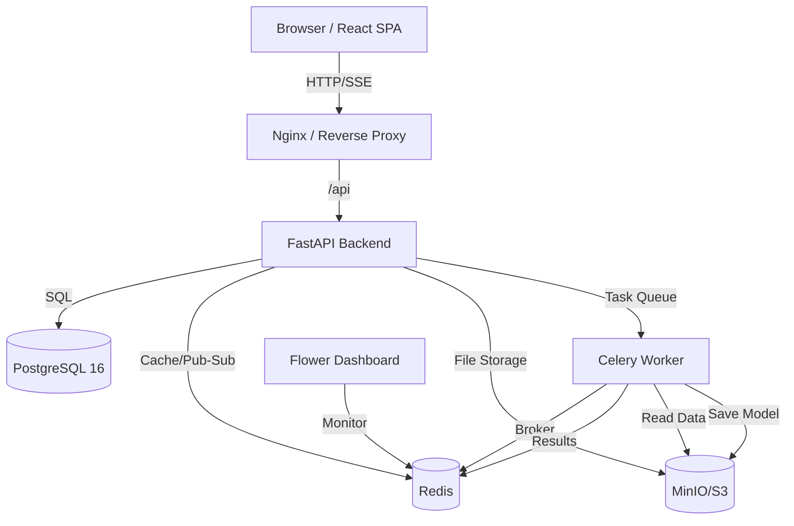
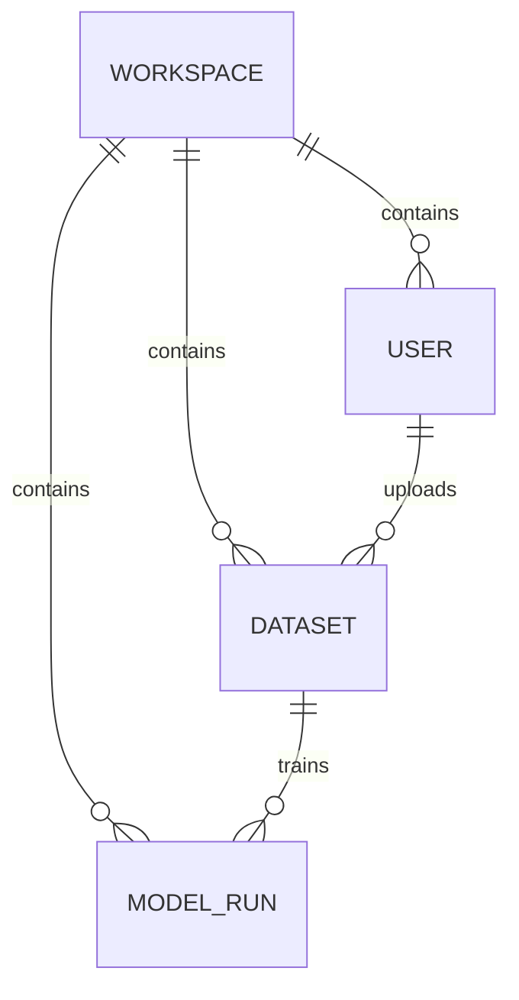
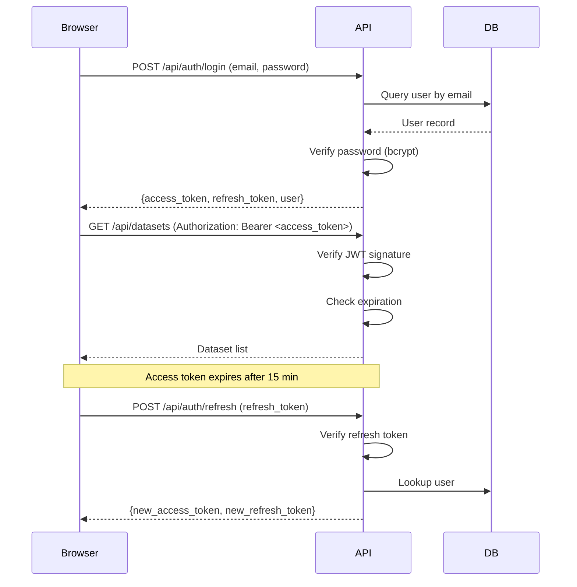
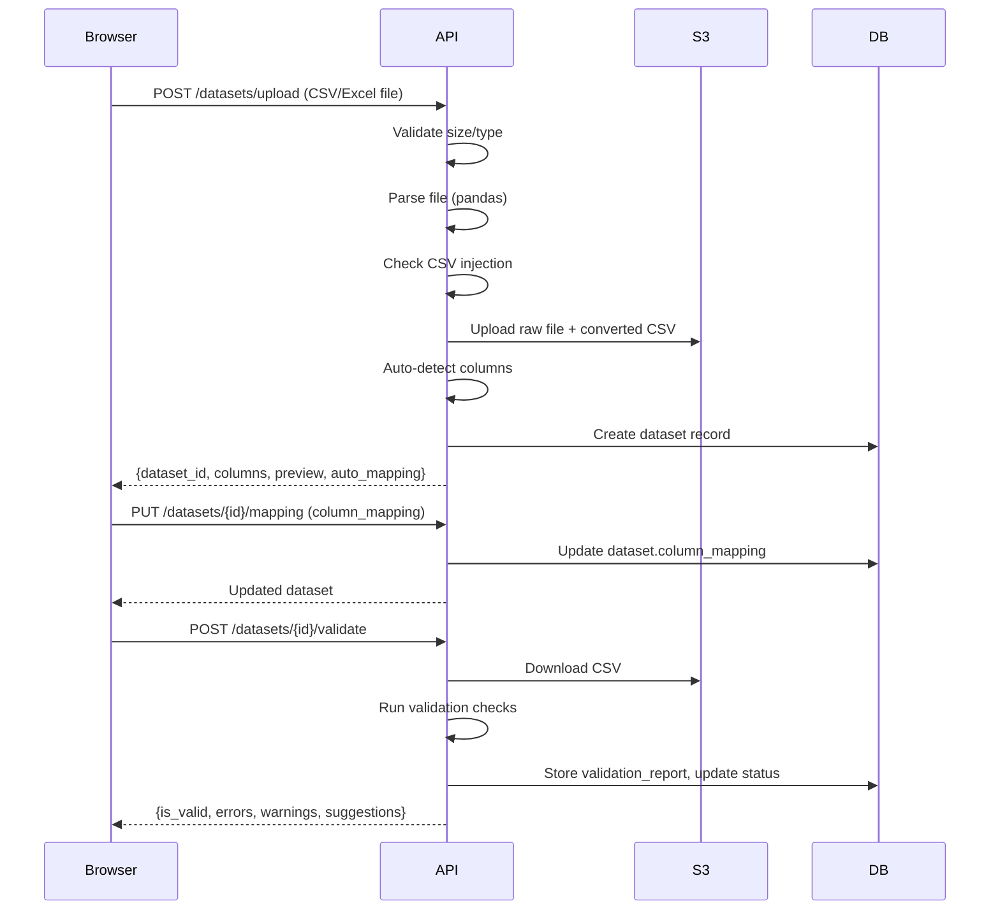
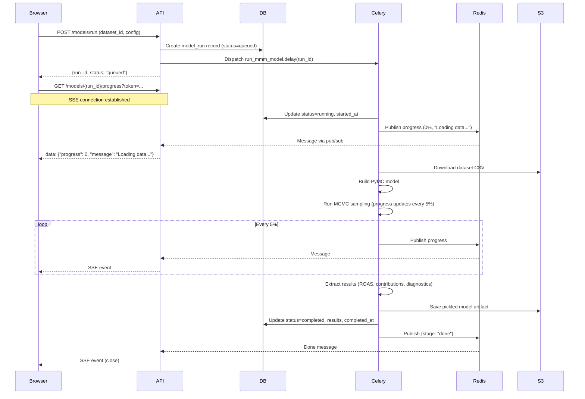

# Architecture Documentation

## System Overview

MixModel is a cloud-based SaaS platform for Bayesian Marketing Mix Modeling. The system follows a modern microservices-inspired architecture with clear separation of concerns.



### Key Components

| Component | Technology | Purpose |
|-----------|-----------|---------|
| **Frontend** | React 18, TypeScript, Vite | Single-page application with data upload wizard and results dashboard |
| **API Server** | FastAPI, Python 3.11 | RESTful API with async endpoints, SSE for real-time progress |
| **Database** | PostgreSQL 16 | Persistent storage with JSONB for flexible schema (configs, results) |
| **Cache & Pub/Sub** | Redis | Results caching, SSE pub/sub, Celery broker and result backend |
| **Object Storage** | MinIO (dev) / S3 (prod) | Raw CSV/Excel files, processed datasets, fitted model artifacts |
| **Task Queue** | Celery | Async model fitting with progress tracking |
| **Monitoring** | Flower | Web UI for Celery task monitoring |

---

## Backend Architecture

### Application Structure

```
backend/
├── app/
│   ├── main.py                    # FastAPI app, middleware, startup hooks
│   ├── api/
│   │   ├── routes/
│   │   │   ├── auth.py           # JWT authentication (register, login, refresh, me)
│   │   │   ├── upload.py         # Dataset upload, preview, mapping, validation, delete
│   │   │   ├── models.py         # Create model runs, list, get, delete, optimize budget
│   │   │   ├── results.py        # SSE progress stream
│   │   │   └── workspace.py      # Workspace stats, dashboard data
│   │   └── dependencies.py       # Dependency injection (get_current_user)
│   ├── core/
│   │   ├── config.py             # Settings (Pydantic BaseSettings)
│   │   ├── database.py           # SQLAlchemy async engine, session factory
│   │   └── security.py           # JWT token creation/verification, password hashing
│   ├── models/                   # SQLAlchemy ORM models
│   │   ├── user.py               # User table
│   │   ├── workspace.py          # Workspace table
│   │   ├── dataset.py            # Dataset table (JSONB: column_mapping, validation_report)
│   │   └── model_run.py          # ModelRun table (JSONB: config, results)
│   ├── schemas/                  # Pydantic request/response models
│   ├── services/                 # Business logic
│   │   ├── storage.py            # S3/MinIO client (upload, download, delete)
│   │   ├── cache.py              # Redis caching (get/set/invalidate)
│   │   ├── progress.py           # Redis pub/sub for SSE progress
│   │   ├── data_validator.py    # Data quality checks (nulls, variance, gaps)
│   │   ├── data_transformer.py  # Column auto-detection, data prep
│   │   └── budget_optimizer.py  # Budget allocation optimizer
│   ├── engine/                   # MMM abstraction
│   │   ├── base.py               # BaseMMM abstract interface
│   │   ├── pymc_engine.py        # PyMC-Marketing implementation
│   │   └── types.py              # Engine data classes
│   └── tasks/
│       ├── celery_app.py         # Celery configuration
│       └── model_tasks.py        # run_mmm_model Celery task
└── alembic/                      # Database migrations
```

### Middleware Stack (Starlette order: last registered runs first)

1. **Request ID** (outermost): Assigns `X-Request-ID` to every request for tracing
2. **Request Logging**: Logs method, path, status, duration with request ID
3. **Security Headers** (innermost): Sets `X-Content-Type-Options`, `X-Frame-Options`, `CSP`, `HSTS`
4. **CORS**: Allows configured origins, credentials, all methods/headers
5. **Rate Limiting** (slowapi): 5/min for login/register, 10/min for token refresh, 20/min for validation

### Error Handling

- **Validation Errors** (422): Returns structured field-level errors
- **Unhandled Exceptions** (500): Logs with request ID, returns generic error
- **Sentry Integration**: Captures exceptions in production (traces_sample_rate: 0.1)

---

## Database Schema

### Core Tables

#### `workspaces`
| Column | Type | Description |
|--------|------|-------------|
| `id` | UUID | Primary key |
| `name` | VARCHAR(255) | Workspace display name |
| `created_at` | TIMESTAMP | Creation timestamp |

#### `users`
| Column | Type | Description |
|--------|------|-------------|
| `id` | UUID | Primary key |
| `email` | VARCHAR(255) | Unique, indexed |
| `hashed_password` | VARCHAR(255) | bcrypt hash |
| `full_name` | VARCHAR(255) | Display name |
| `role` | VARCHAR(50) | Default: "admin" |
| `workspace_id` | UUID | Foreign key → workspaces.id |
| `created_at` | TIMESTAMP | Creation timestamp |

**Indexes:**
- `users_email_idx` (unique)
- `users_workspace_id_idx`

#### `datasets`
| Column | Type | Description |
|--------|------|-------------|
| `id` | UUID | Primary key |
| `workspace_id` | UUID | Foreign key → workspaces.id (indexed) |
| `uploaded_by` | UUID | Foreign key → users.id |
| `filename` | VARCHAR(255) | Original filename |
| `s3_key` | VARCHAR(512) | S3/MinIO object key |
| `row_count` | INTEGER | Number of data rows |
| `date_range_start` | DATE | Earliest date in dataset |
| `date_range_end` | DATE | Latest date in dataset |
| `frequency` | VARCHAR(20) | Default: "weekly" |
| `column_mapping` | JSONB | User-defined column mapping |
| `validation_report` | JSONB | Validation results (errors, warnings, suggestions) |
| `status` | VARCHAR(50) | uploaded → validated → validation_error |
| `created_at` | TIMESTAMP | Upload timestamp |

**Indexes:**
- `datasets_workspace_id_idx`

**Example `column_mapping` JSONB:**
```json
{
  "date_column": "week",
  "target_column": "revenue",
  "media_columns": {
    "tv_spend": {"channel_name": "TV", "spend_type": "spend"},
    "facebook_spend": {"channel_name": "Facebook", "spend_type": "spend"}
  },
  "control_columns": ["temperature", "holiday"]
}
```

#### `model_runs`
| Column | Type | Description |
|--------|------|-------------|
| `id` | UUID | Primary key |
| `workspace_id` | UUID | Foreign key → workspaces.id (indexed) |
| `dataset_id` | UUID | Foreign key → datasets.id |
| `created_by` | UUID | Foreign key → users.id |
| `name` | VARCHAR(255) | User-provided run name |
| `status` | VARCHAR(50) | queued → running → completed/failed |
| `progress` | INTEGER | 0-100 percentage |
| `config` | JSONB | Model configuration (adstock, saturation, priors) |
| `results` | JSONB | Full model results (ROAS, contributions, diagnostics) |
| `model_artifact_s3_key` | VARCHAR(512) | S3 key for pickled model object |
| `error_message` | TEXT | Error details if failed |
| `started_at` | TIMESTAMP | When Celery task started |
| `completed_at` | TIMESTAMP | When Celery task finished |
| `created_at` | TIMESTAMP | Creation timestamp |

**Indexes:**
- `model_runs_workspace_id_idx`
- `model_runs_dataset_id_idx`
- Composite index: `(workspace_id, created_at DESC)` for dashboard queries

**Example `config` JSONB:**
```json
{
  "mode": "quick",
  "n_samples": 500,
  "n_chains": 2,
  "adstock_type": "geometric",
  "saturation_type": "logistic",
  "tune_steps": 1000
}
```

### Relationships



---

## Authentication Flow

### JWT Token Architecture

MixModel uses a dual-token system:
- **Access Token**: Short-lived (15 min), used for API requests
- **Refresh Token**: Long-lived (7 days), used to get new access tokens



### Token Payload Structure

**Access Token:**
```json
{
  "sub": "user-uuid",
  "type": "access",
  "workspace_id": "workspace-uuid",
  "exp": 1234567890
}
```

**Refresh Token:**
```json
{
  "sub": "user-uuid",
  "type": "refresh",
  "exp": 1234567890
}
```

### Frontend Token Refresh Interceptor

The frontend uses an Axios interceptor to automatically refresh expired tokens:
1. Request fails with 401
2. Interceptor calls `/auth/refresh` with refresh token
3. If successful, retry original request with new access token
4. If refresh fails, redirect to login

---

## Data Pipeline

### Upload → Validate → Store Flow



### Column Auto-Detection

The `DataTransformer` service uses heuristics to detect column roles:
- **Date Column**: Looks for "date", "week", "month" in name; validates date parsing
- **Target Column**: Searches for "revenue", "sales", "conversions"
- **Media Columns**: Identifies "spend", "impressions", "clicks" with channel prefix
- **Control Columns**: Detects "temperature", "holiday", "competitor"

### Validation Checks

The `DataValidator` service reports three severity levels:

**Errors** (block model training):
- Missing required columns
- Date parsing failures
- Non-numeric media/target columns
- Negative spend values

**Warnings** (can proceed but risky):
- High null percentage (>20%)
- Low variance columns
- Date gaps
- Spend spikes (>5x median)

**Suggestions** (best practices):
- Log-transform skewed columns
- Add control variables
- Fill date gaps

---

## MMM Engine Architecture

### BaseMMM Abstract Interface

The `BaseMMM` class in `engine/base.py` defines a pluggable interface for different MMM libraries (PyMC-Marketing, Robyn, Meridian, LightweightMMM):

```python
class BaseMMM(ABC):
    @abstractmethod
    def prepare_data(self, df: pd.DataFrame, mapping: dict) -> PreparedData:
        """Clean and transform raw data into engine-ready format."""

    @abstractmethod
    def build_model(self, data: PreparedData) -> None:
        """Construct the statistical model from prepared data."""

    @abstractmethod
    def fit(self, data: PreparedData, progress_callback: Callable[[int, str], None]) -> None:
        """Run model fitting (MCMC sampling) with progress updates."""

    @abstractmethod
    def extract_results(self) -> EngineResults:
        """Extract all results after fitting."""

    @abstractmethod
    def serialize_model(self) -> bytes:
        """Serialize the fitted model for storage."""

    @abstractmethod
    def get_diagnostics(self) -> dict:
        """Return convergence diagnostics (R-hat, ESS)."""
```

### PyMC-Marketing Implementation

**Adstock Transformations:**
- **Geometric**: `y[t] = x[t] + alpha * y[t-1]` (exponential decay)
- **Weibull**: `y[t] = sum(x[t-i] * weibull_pdf(i))` (flexible decay shape)

**Saturation Transformations:**
- **Logistic**: `y = L / (1 + exp(-k * (x - x0)))` (s-curve)
- **Hill**: `y = (x^s) / (k^s + x^s)` (diminishing returns)

**Prior Defaults:**
```python
{
    "adstock_alpha": {"dist": "beta", "params": [2, 2]},      # Decay rate
    "saturation_lambda": {"dist": "gamma", "params": [1, 1]},  # Half-saturation
    "saturation_slope": {"dist": "gamma", "params": [2, 1]},   # Curve steepness
    "intercept": {"dist": "normal", "params": [0, 10]},
    "likelihood_sigma": {"dist": "half_normal", "params": [1]},
}
```

---

## Model Execution Flow

### Celery Task Pipeline



### Progress Tracking via Redis Pub/Sub

**Publisher (Celery Worker):**
```python
progress_service = ProgressService()
progress_service.publish_progress(
    run_id="abc-123",
    progress=50,
    message="Sampling chain 2 of 4",
    stage="sampling"
)
```

**Subscriber (FastAPI SSE):**
```python
pubsub = progress_service.subscribe(run_id)
while True:
    message = pubsub.get_message()
    if message:
        yield {"event": "progress", "data": message["data"]}
```

**Progress Stages:**
1. `loading` (0-10%): Load data from S3
2. `preparing` (10-15%): Transform data, build model
3. `tuning` (15-30%): MCMC tuning phase
4. `sampling` (30-90%): Main sampling phase (updates every 5%)
5. `extracting` (90-100%): Extract results, save to S3
6. `done` / `error`: Final status

### Graceful Timeout Handling

Celery tasks have a 30-minute soft timeout:
```python
@celery_app.task(bind=True, time_limit=1800, soft_time_limit=1740)
def run_mmm_model(self, run_id: str):
    try:
        # Model fitting logic
    except SoftTimeLimitExceeded:
        # Save partial results, update status to failed
        raise
```

---

## Results Architecture

### Three-View System

MixModel provides three views tailored to different stakeholders:

#### 1. Executive View
**Target Audience:** C-suite, executives

**Key Metrics:**
- Total spend and revenue
- Blended ROAS across all channels
- Revenue decomposition pie chart (media vs baseline vs controls)
- AI-generated recommendations (top 3 insights)

**API Response:**
```json
{
  "total_spend": 1000000,
  "total_revenue": 2500000,
  "blended_roas": 2.5,
  "revenue_breakdown": {
    "media": 1500000,
    "baseline": 800000,
    "controls": 200000
  },
  "recommendations": [
    "Increase Facebook budget by 20% for optimal ROAS",
    "TV spend is near saturation point",
    "Holiday effect contributes 8% to revenue"
  ]
}
```

#### 2. Manager View
**Target Audience:** Marketing managers, media buyers

**Key Metrics:**
- ROAS by channel (bar chart)
- Saturation curves (spend vs response)
- Adstock decay curves (carryover effects)
- Revenue waterfall chart (channel contributions)

**API Response:**
```json
{
  "channel_roas": {
    "Facebook": 3.2,
    "TV": 1.8,
    "Search": 4.5
  },
  "saturation_curves": {
    "Facebook": {
      "spend_range": [0, 50000, 100000, ...],
      "response": [0, 120000, 200000, ...]
    }
  },
  "adstock_curves": {
    "TV": {
      "weeks": [0, 1, 2, 3, 4],
      "effect": [1.0, 0.6, 0.36, 0.22, 0.13]
    }
  }
}
```

#### 3. Analyst View
**Target Audience:** Data scientists, analysts

**Key Metrics:**
- Posterior distributions for all coefficients
- Convergence diagnostics (R-hat, ESS)
- Actual vs predicted plot with HDI bands
- Residual analysis

**API Response:**
```json
{
  "posteriors": {
    "facebook_coefficient": {
      "mean": 2.3,
      "std": 0.4,
      "hdi_3%": 1.6,
      "hdi_97%": 3.0,
      "samples": [2.1, 2.5, 2.2, ...]
    }
  },
  "diagnostics": {
    "facebook_coefficient": {
      "rhat": 1.01,
      "ess_bulk": 1800,
      "ess_tail": 1650
    }
  },
  "fit": {
    "dates": ["2024-01-01", "2024-01-08", ...],
    "actual": [100000, 105000, ...],
    "predicted": [98000, 106000, ...],
    "hdi_lower": [95000, 102000, ...],
    "hdi_upper": [101000, 110000, ...]
  }
}
```

### Budget Optimizer

The `BudgetOptimizer` service uses response curves to allocate a total budget for maximum return:

**Algorithm:**
1. Load response curves from model results
2. For each channel, evaluate marginal ROI at different spend levels
3. Use scipy.optimize to maximize total return subject to:
   - Sum of allocations = total budget
   - Each channel >= min spend (default: 0)
   - Each channel <= max spend (default: infinity)

**API Request:**
```json
{
  "total_budget": 1000000,
  "min_per_channel": {"TV": 50000},
  "max_per_channel": {"Facebook": 300000}
}
```

**API Response:**
```json
{
  "optimized_allocation": {
    "Facebook": 300000,
    "TV": 400000,
    "Search": 300000
  },
  "predicted_revenue": 3200000,
  "predicted_roas": 3.2,
  "marginal_roas": {
    "Facebook": 2.1,
    "TV": 1.5,
    "Search": 4.0
  }
}
```

---

## Caching Strategy

### Redis Caching

**Purpose:** Reduce database load and API latency for expensive queries

**Cache Keys:**
- `results:{run_id}` → Full model results JSON (TTL: 1 hour)
- `dashboard:stats:{workspace_id}` → Dashboard stats (TTL: 5 minutes)

**Cache Invalidation:**
- Explicit: `invalidate(key)` called when model run deleted
- TTL-based: Automatic expiration after TTL

**Implementation:**
```python
# services/cache.py
def get_cached(key: str) -> dict | None:
    redis = Redis.from_url(settings.redis_url)
    data = redis.get(key)
    return json.loads(data) if data else None

def set_cached(key: str, value: dict, ttl_seconds: int) -> None:
    redis = Redis.from_url(settings.redis_url)
    redis.setex(key, ttl_seconds, json.dumps(value))
```

**Usage Pattern:**
```python
@router.get("/{run_id}/results")
async def get_results(run_id: str):
    cache_key = f"results:{run_id}"
    cached = get_cached(cache_key)
    if cached:
        return cached

    # Load from DB
    results = model_run.results
    set_cached(cache_key, results, ttl_seconds=3600)
    return results
```

---

## Observability

### Sentry Integration

**Backend:**
```python
import sentry_sdk

sentry_sdk.init(
    dsn=settings.sentry_dsn,
    environment=settings.app_env,
    traces_sample_rate=0.1,  # 10% of requests
)
```

**Frontend:**
```typescript
Sentry.init({
  dsn: import.meta.env.VITE_SENTRY_DSN,
  environment: import.meta.env.MODE,
  tracesSampleRate: 0.1,
});
```

**What Gets Captured:**
- Unhandled exceptions
- Failed HTTP requests (4xx/5xx)
- Performance traces (10% sample)
- Breadcrumbs (API calls, user actions)

### Structured Logging

In production (`APP_ENV=production`), logs are JSON-formatted:

```json
{
  "timestamp": "2026-02-10T12:34:56Z",
  "level": "INFO",
  "name": "mixmodel",
  "message": "[abc-123] GET /api/datasets -> 200 (45ms)"
}
```

**Log Aggregation:** Stream JSON logs to CloudWatch, Datadog, or ELK stack for centralized monitoring.

### Health Checks

**Endpoint:** `GET /health`

**Checks:**
- PostgreSQL: `SELECT 1` query
- Redis: `PING` command
- MinIO/S3: `list_buckets()` call
- Celery: `control.ping(timeout=2.0)`

**Response:**
```json
{
  "status": "healthy",  // "healthy" | "degraded"
  "version": "0.1.0",
  "checks": {
    "database": "healthy",
    "redis": "healthy",
    "storage": "healthy",
    "celery": "healthy"
  }
}
```

**Use Case:** Configure load balancer health checks to hit `/health` every 30 seconds.

### Flower Dashboard

**URL:** http://localhost:5555 (default: admin/changeme)

**Metrics:**
- Active/queued/completed tasks
- Worker status and concurrency
- Task success/failure rates
- Task runtime distribution

---

## Security

### Security Headers

All responses include:
- `X-Content-Type-Options: nosniff`
- `X-Frame-Options: DENY`
- `X-XSS-Protection: 1; mode=block`

**Production only:**
- `Strict-Transport-Security: max-age=31536000; includeSubDomains`
- `Content-Security-Policy: default-src 'self'; script-src 'self' 'unsafe-inline' ...`

### Input Validation

- **File Upload:** 50 MB max, only CSV/XLSX allowed
- **CSV Injection:** Column names sanitized (strip leading `=`)
- **SQL Injection:** SQLAlchemy ORM prevents direct SQL execution
- **XSS:** React escapes all user input by default

### Rate Limiting

- Auth endpoints: 5/min (login, register), 10/min (refresh)
- Validation: 20/min
- Model runs: 5/min
- Budget optimization: 20/min

---

## Deployment Considerations

### Scaling Strategies

**Horizontal Scaling:**
- **API Server:** Deploy multiple FastAPI containers behind load balancer
- **Celery Workers:** Add more worker containers (set `--concurrency=N`)
- **Database:** Read replicas for dashboard queries (configure SQLAlchemy read/write split)

**Vertical Scaling:**
- **Celery Workers:** Increase CPU/RAM for faster model fitting
- **PostgreSQL:** Upgrade instance for more concurrent connections

### Database Indexing

**Critical Indexes:**
- `(workspace_id, created_at DESC)` on `model_runs` for dashboard queries
- `workspace_id` on all tenant tables
- `email` on `users` for login queries

### Connection Pooling

**PostgreSQL:** AsyncPG with SQLAlchemy 2.0 async pool (default: 5 min, 20 max)
**Redis:** Connection pooling via `redis-py` (default: 50 max)

---

## Technology Choices

### Why FastAPI?
- Async/await support for I/O-bound operations (S3, Redis pub/sub)
- Automatic OpenAPI docs
- Pydantic v2 for fast validation

### Why PostgreSQL?
- JSONB for flexible schema (config, results)
- Strong consistency and ACID guarantees
- Full-text search for future features

### Why Celery?
- Mature task queue with retry/timeout support
- Flower dashboard for monitoring
- Redis broker for low latency

### Why PyMC-Marketing?
- Pure Bayesian approach (uncertainty quantification)
- Flexible priors and model customization
- Active development and community support
